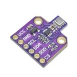
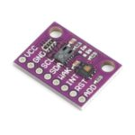
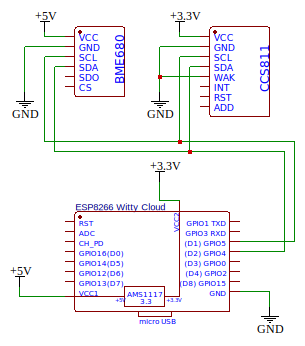

# Introduction

The airocat is a simple meteo station for indoor placement. The main board is `ESP8266 Witty Cloud` based on `ESP8266` controller.

Two sensors are used to gather various indicators:
* BME680 I2C/5В (Bosch)

* CCS811 + HDC1080

Scheme of connecting:

## Indicators

Following indicators are gathered by both sensors:

|            Name           | Unit |     MQTT topic                 |  
| ------------------------- | ---- | ------------------------------ |  
| IAQ                       |      | airocat/iaq                    |  
| CO2 (equivalent)          |      | airocat/co2Eq                  |  
| BreathVoc (equivalent)    |      | airocat/breathVocEq            | 
| Temperature               |   °C | airocat/temperature            |
| Humidity                  |    % | airocat/humidity               |
| Pressure                  |  hPa | airocat/pressure               |
| Gar (resistance)          |  Ohm | airocat/gasResistance          |
| Gar (percentage)          |    % | airocat/gasPercentage          |
| Initial status            |      | airocat/initialStabStatus      |
| PowerOn status            |      | airocat/powerOnStabStatus      |
| CO2                       |  ppm | airocat/co2Eq                  |
| TVOC                      |  ppb | airocat/breathVocEq            |

The result of measurements are sent through MQTT using dedicated for each indicator topic.
Additionally, there is an optional `HomeAssistant` MQTT discovery mechanism supporting.

# Building

To build project you need installed [PlatformIO](https://platformio.org/) platform.

Following options are needed to set:

|            Name           |                   Description                     |  
| ------------------------- | ------------------------------------------------- |  
| wifi.ssid                 | The WiFi network name                             | 
| wifi.pass                 | The WiFi network password                         | 
| mqtt.host                 | The MQTT service IP address                       | 
| mqtt.port                 | The MQTT service TCP port number                  | 
| mqtt.user                 | The MQTT service user name for authentication     | 
| mqtt.pass                 | The MQTT service user password for authentication | 
| homeassistant.integrate   | Enable or not HomeAssistant integration           | 
